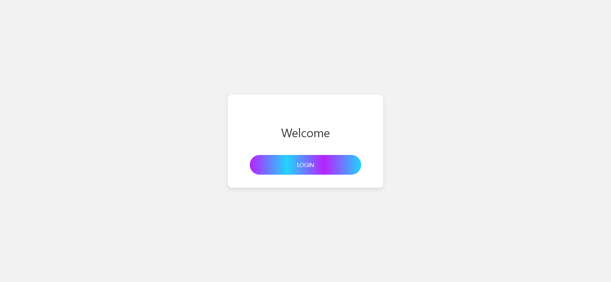
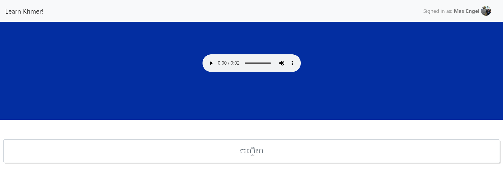
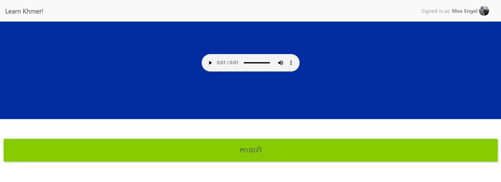
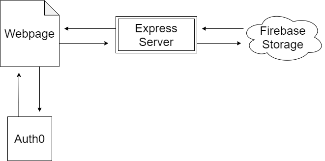

## Khmer Practice Website

> Web app to help drill Khmer listening and vocabulary

### Summary

A single-page app to help you practice listening to Khmer vocabulary.

### Screenshot

### The Need

I love learning Khmer, but there aren't many resources online to practice. Now that I've moved back to the US, it's even harder for me to practice. I wanted to create a way to help my listening comprehension using the limited resources online. Google Translate audio is pretty bad, so I used the audio from https://kheng.info/. I also used vocabulary from their popular word frequency list, but it looks like they got their list from news sources so the words are too specific to be useful (ex - political party, constitution, legality, etc.).

### Tech-stack

React, Express, Auth0, Firebase Storage and Hosting

### Architecture

